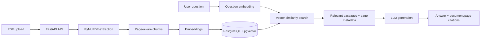

<div align="center">

# AI Document Assistant

**Turn PDFs into searchable knowledge with grounded, page-cited answers.**

A full-stack Retrieval-Augmented Generation (RAG) application built with **FastAPI, React, PostgreSQL and pgvector**.

[](https://github.com/LucasDiasRamos/ai-document-assistant/actions/workflows/backend-ci.yml)
[](backend/)
[](frontend/)
[](docker-compose.yml)

[Features](#features) · [Architecture](#architecture-at-a-glance) · [Run locally](#quick-start) · [Tests](#backend-pull-request-ci) · [Technical docs](#documentation)

</div>

## Why this project?

Information in manuals, technical reports, and policies is often buried across long PDF files. This application combines semantic search with language-model generation so users can ask questions and inspect **which documents and pages support each answer**. When retrieval evidence is weak, the application can return an insufficient-context response instead of presenting an unsupported answer.

## Features

- **PDF lifecycle:** upload with server-side validation, page-aware text extraction, chunking, document listing, status display, and confirmed deletion.
- **Source-aware RAG:** OpenAI embeddings, pgvector similarity retrieval, configurable relevance threshold, and answers with document/page references.
- **Usable web experience:** responsive document/chat workspace, upload progress and errors, loading/retry states, citation chips, and accessible controls.
- **Engineering practices:** Alembic migrations, environment-driven configuration, structured observability, backend tests, frontend tests, and reproducible RAG evaluation fixtures.
- **Local-first development:** Docker Compose for the API and PostgreSQL; Vite frontend with a development API proxy.

The app's current functionality and remaining work are tracked in [Implementation status](docs/implementation-status.md). These are repository features; no public hosted demo is currently advertised.

## Demo and screenshots

A hosted demo and verified application screenshots have **not been published yet**. To see the actual interface, run the project locally using the instructions below. Interface screenshots or a short GIF can be added here once captured from a running instance.

## Architecture at a glance



The backend keeps ingestion, retrieval, prompt construction and response generation as explicit components. See [ARCHITECTURE.md](ARCHITECTURE.md) for component boundaries, data models, security notes, and design trade-offs.

## Tech stack

| Layer | Technologies |
| --- | --- |
| Frontend | React 19, TypeScript, Vite, Vitest, React Testing Library |
| API | Python, FastAPI, SQLAlchemy, Pydantic |
| Retrieval | pgvector, semantic search, OpenAI embeddings |
| Document processing | PyMuPDF, page-aware text chunks |
| Persistence | PostgreSQL 16, Alembic, local PDF storage |
| LLM | OpenAI Responses API through provider-neutral abstractions |
| Tooling | Docker Compose, Pytest, CI, structured logs |

## Quick start

**Prerequisites:** Docker with Compose v2, Node.js 20.19+ (or 22.12+), npm, and an API key for AI-powered document ingestion/chat.

```bash
git clone https://github.com/LucasDiasRamos/ai-document-assistant.git
cd ai-document-assistant
docker compose up --build --wait -d
cd frontend
cp .env.example .env
npm install
npm run dev
```

Open the URL displayed by Vite (usually http://localhost:5173). The API is available at http://localhost:8000 and its Swagger documentation at http://localhost:8000/docs. Configure `OPENAI_API_KEY` before using the embedding and chat workflows; health endpoints do not require a paid API call. For Windows PowerShell, copy the frontend environment file with `Copy-Item .env.example .env`.

**Note:** Compose is intended for localhost development with disposable default credentials, **not for public deployment**. See the complete setup and security notes below.

## Documentation

- [Product requirements](PRD.md) — goals, scope, and user stories
- [System architecture](ARCHITECTURE.md) — data flow, components, and design decisions
- [Implementation status](docs/implementation-status.md) — implemented features and planned work
- [Development backlog](backlog.md) — task-level roadmap

---

## Run the backend and database with Docker Compose

From the repository root, with Docker Compose v2 installed:

```bash
# Optional: put POSTGRES_PASSWORD, OPENAI_API_KEY and LLM_MODEL in a root .env.
docker compose up --build --wait -d
curl -f http://localhost:8000/health
curl -f http://localhost:8000/health/database
```

The API image includes its Alembic migrations. Compose waits for PostgreSQL
to become healthy, then the API applies migrations before starting Uvicorn.
`postgres_data` preserves the database and `document_storage` preserves PDF
uploads across regular restarts and `docker compose down`. Never run
`docker compose down -v` unless you intend to delete those volumes.

Both published ports bind only to localhost. This is a **local development**
configuration with disposable default database credentials, not a public
deployment manifest. For real data, set a strong `POSTGRES_PASSWORD` in the
root `.env` (URL-encode special characters for the database connection string).
No paid AI API call is required to boot or check health; document ingestion and
chat still require a valid `OPENAI_API_KEY` and model.

```bash
bash scripts/smoke-compose.sh  # optional health/restart check on Linux/macOS
docker compose down            # stops services, retains volumes
```

To run the backend natively instead, follow the steps below and start
**only PostgreSQL** with `docker compose up -d postgres` so the container API
does not occupy port 8000.

## Local setup

### 1. Clone and enter the project

```bash
git clone https://github.com/LucasDiasRamos/ai-document-assistant.git
cd ai-document-assistant
```

### 2. Start PostgreSQL

```bash
docker compose up -d postgres
```

### 3. Create the backend environment

```bash
cd backend
python -m venv .venv
```

Windows:

```bash
.venv\Scripts\activate
```

Linux/macOS:

```bash
source .venv/bin/activate
```

### 4. Install dependencies

```bash
pip install -r requirements.txt
```

### 5. Configure environment variables

Copy `.env.example` to `backend/.env`, then set `LLM_MODEL` to a model available to your OpenAI API project before starting the application.

### 6. Configure the frontend

Use Node `20.19+` within the Node 20 line, or Node `22.12+`. Node 21 and Node 22.0–22.11 are intentionally not supported because Vite 8 excludes those runtimes.

From the repository root:

```bash
cd frontend
cp .env.example .env
npm install
```

The frontend uses a same-origin API path in development:

```env
VITE_API_BASE_URL=/api
```

Vite proxies `/api` requests to `http://localhost:8000`, so browser requests stay same-origin and do not require development CORS. Production may use either a same-origin root-relative path behind a reverse proxy or an absolute HTTP(S) API root such as `https://api.example.com/api`.

Invalid or missing API base values fail during frontend startup with a clear configuration error.

Run the frontend:

```bash
npm run dev
```

Run frontend tests:

```bash
npm run test:run
```

Create a production build:

```bash
npm run build
```

### 7. Apply database migrations

From `backend/`:

```bash
alembic upgrade head
```

This enables pgvector and creates the current persistence schema.

### 8. Run the API

From `backend/`:

```bash
uvicorn app.main:app --reload
```

Open:

- Swagger: `http://localhost:8000/docs`
- Health: `http://localhost:8000/health`
- Database health: `http://localhost:8000/health/database`

## Backend pull-request CI

`.github/workflows/backend-ci.yml` validates backend changes on pull requests
and on pushes to `main` that affect backend code, Compose, or the workflow.

The `tests` job installs Python 3.12 dependencies, waits for a disposable
PostgreSQL 16 + pgvector service, applies Alembic migrations, then runs the
complete `pytest` suite. This includes database-backed retrieval tests that
otherwise skip when PostgreSQL is unavailable.

The `compose-smoke` job validates Compose syntax, builds the backend image,
starts PostgreSQL and the API, waits for health checks, then verifies HTTP
readiness and the expected Alembic revision.

Both jobs use throwaway CI-only database passwords and a dummy model name. They
do not need any paid AI API credentials, and provider requests in tests should
remain mocked. No production credentials or sensitive customer documents may
be added to workflow environment variables.

To reproduce the checks locally:

```bash
cd backend
alembic upgrade head
python -m pytest -q
cd ..
docker compose config --quiet
bash scripts/smoke-compose.sh
```

Docker Compose tests require a running Docker daemon and Docker Compose v2.

## Product goal

The initial version intentionally avoids a heavy RAG framework. The goal is to make ingestion, chunking, embeddings, retrieval, prompt construction, and citation handling explicit and easy to understand.

## License

A license has not been selected yet.


### Frontend tests

The frontend has its own GitHub Actions job in
`.github/workflows/frontend-ci.yml`. On frontend pull requests and pushes to
`main`, it installs Node 22 dependencies, runs the Vitest component/workflow
regression suite, and checks the TypeScript + Vite production build. Both
checks must succeed before merging the frontend. Until a committed
`frontend/package-lock.json` is introduced, CI uses `npm install`; locking
dependencies is recommended for reproducible builds.

Run the full frontend regression suite once with:

```bash
cd frontend
npm test
```

Use `npm run test:watch` for local watch mode.


### RAG evaluation

Run the retrieval-quality fixtures without a paid generation provider:

```bash
cd backend
pytest tests/test_rag_evaluation.py -q
```

The always-on portion extracts and chunks the committed synthetic PDFs and checks expected page retrieval with deterministic test embeddings. When the configured PostgreSQL/pgvector test database is available, the same corpus also runs through the production ingestion and pgvector retrieval path.

## Security baseline for a public demo (API-25)

For a public environment set `APP_ENVIRONMENT=production` and
`CORS_ALLOWED_ORIGINS` to a JSON list of **exact HTTPS frontend origins**,
such as `["https://frontend.example.com"]`. Startup rejects missing,
wildcard or plain-HTTP production origins. The production application disables
Swagger, ReDoc, OpenAPI and debug traces.

The production API applies a lightweight in-process sliding-window limit to
anonymous `POST /api/chat` and `POST /api/documents` requests. Exceeded
requests return HTTP 429, the stable `rate_limited` code and
`Retry-After`. Quotas can be tuned with
`CHAT_REQUESTS_PER_MINUTE`, `UPLOAD_REQUESTS_PER_MINUTE` and
`RATE_LIMIT_WINDOW_SECONDS`. Existing PDF-size/type/signature constraints,
provider request timeouts, and safe API error envelopes are retained.
Upload filenames containing path separators or control characters are rejected.

**Important:** The rate limiter uses only the ASGI peer address, not
untrusted forwarded IP headers, and tracks limits per worker. Behind reverse
proxies or across multiple workers, implement a trusted ingress-level
distributed rate limiter and provider billing quotas. CORS is not access
control or authentication. This portfolio MVP has **shared anonymous
documents** and no tenant isolation; do not expose private PDFs or customer
data, and protect/seed a public demo with non-sensitive, disposable fixtures.
Configure credentials in hosting platform secrets, never in source or bundled
frontend code. For a production multi-tenant system, add authentication,
authorization, data isolation, and retention/deletion controls first.
